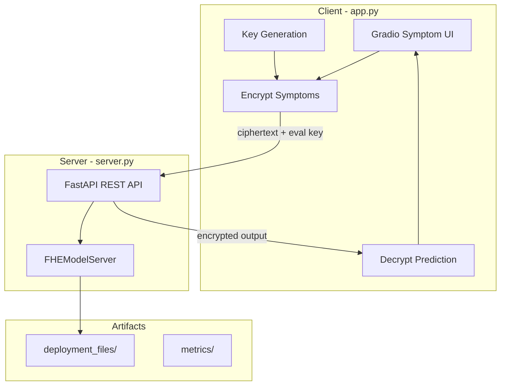
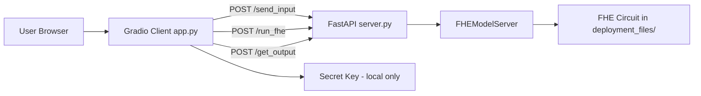
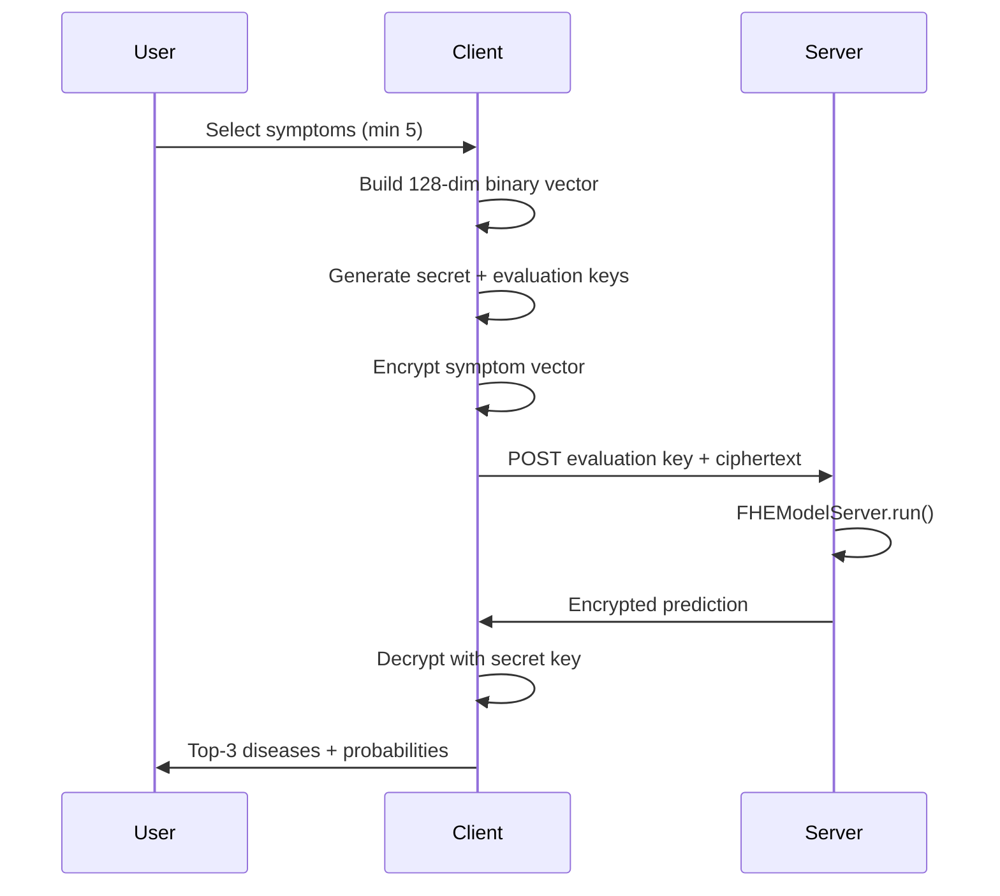

# Healthcare Prediction on Encrypted Data Using Fully Homomorphic Encryption (SecureMed)

**Course:** COMP 8047 — Major Project  
**Student:** Derek Wong `A01042588`  
**Institution:** British Columbia Institute of Technology (BCIT)  
**Date of Submission:** June 2026  
**Supervisor:** `D'Arcy Smith`  
**Version:** Draft 1.0 — for review

---

## Table of Contents

1. [Introduction](#1-introduction)
2. [Body](#2-body)
3. [Conclusion](#3-conclusion)
4. [Appendix](#4-appendix) (includes [Abbreviations — Appendix F](#f-abbreviations))
5. [References](#5-references)

---

## 1. Introduction

### 1.1 Student Background

I bring a multidisciplinary background spanning healthcare, software engineering, and network security. Earlier studies in Pharmacy at the University of British Columbia exposed me to clinical workflows and the sensitivity of patient health information. Subsequent experience in IT and security roles reinforced the importance of protecting data in transit and at rest.

This combination directly supports SecureMed: a prototype that applies Fully Homomorphic Encryption (FHE) to symptom-based disease prediction. The project requires understanding both the clinical context of symptom checkers and the cryptographic constraints of encrypted machine learning.

### 1.2 Project Description

SecureMed is a browser-accessible demonstration application that lets a user enter symptoms, encrypt them locally, send only ciphertext and an evaluation key to a server, run inference on encrypted data, and decrypt the prediction on the client. The system targets telemedicine-style symptom checkers where users want preliminary guidance without exposing raw health data to a remote server.

**Target users:** Patients or demo participants evaluating a privacy-preserving symptom checker workflow.

**Main functionality:**

- Guided symptom selection via a Gradio web user interface (UI) (`app.py`)
- Client-side key generation, encryption, and decryption using Concrete-ML `FHEModelClient`
- Server-side encrypted inference via FastAPI (`server.py`) — a Python Application Programming Interface (API) — using `FHEModelServer`
- Top-3 disease predictions with probabilities and an uncertainty prompt when confidence is low

The application supports two FHE-compiled classifiers on the Kaggle Disease Prediction dataset (41 disease classes, 128 binary symptom features): a logistic regression baseline and a shallow `ConcreteXGBClassifier` tree ensemble. The user selects which model to run before entering symptoms.

### 1.3 Essential Problems

Telemedicine symptom checkers offer fast preliminary medical guidance, but they typically require patients to transmit sensitive health information to remote servers. This creates hesitation and privacy risk, especially when users are unsure whether they need care.

The essential problem SecureMed addresses is: **can encrypted machine learning (ML) inference be accurate, fast, and understandable enough to support a real symptom-checker workflow on a single-host prototype?**

### 1.4 Goals and Objectives

| Goal | Objective | Success criterion |
|------|-----------|-------------------|
| Privacy-preserving inference | Raw symptoms never leave the client | Only evaluation keys and ciphertexts are transmitted |
| Accuracy preservation | FHE predictions match cleartext within tolerance | Accuracy delta ≤ 5.0 percentage points (pp) |
| Practical latency | Inference is responsive on a single host | Median FHE latency ≤ 5 s; median end-to-end (E2E) latency ≤ 5 s |
| Reproducible evidence | Measurements archived and verifiable | `metrics/` and `artifacts/` stores populated |
| Fixed input schema | Symptom vector is 128 binary features | Confirmed in `artifacts/input_vector_size.log` |

---

## 2. Body

### 2.1 Background

The growing use of telemedicine symptom checkers has created tension between accessibility and privacy. These tools analyze symptom combinations to suggest possible conditions, but the data they collect — fever patterns, gastrointestinal symptoms, mental-health indicators — is highly sensitive.

Fully Homomorphic Encryption (FHE) allows computation on encrypted data without decryption. Recent FHE compiler frameworks, including Zama's Concrete and Concrete-ML, have made it feasible to compile scikit-learn-compatible models into encrypted circuits. However, FHE remains computationally expensive: ciphertexts are large, non-linear operations are costly, and latency can exceed cleartext inference by orders of magnitude.

SecureMed situates itself as an applied study rather than a cryptographic proof. It examines whether a complete client–server workflow — key generation, encryption, server-side FHE execution, and client-side decryption — can meet practical thresholds on a single development host using publicly available data.

### 2.2 Project Statement

SecureMed implements a privacy-preserving symptom-to-diagnosis prediction pipeline. A Python Gradio client collects symptoms, encodes them as a fixed-length 128-dimensional binary vector, encrypts the vector locally, and transmits ciphertext plus an evaluation key to a FastAPI server. The server runs a precompiled FHE logistic regression model and returns an encrypted prediction. The client decrypts locally and presents the top disease matches.

The server never receives the secret key and never sees plaintext symptoms or predictions.

### 2.3 Possible Alternative Solutions

| Approach | Strengths | Weaknesses |
|----------|-----------|------------|
| **Plaintext ML (status quo)** | Fast, simple, mature tooling | Server sees all symptom data |
| **Trusted Execution Environments (TEEs)** | Near-cleartext performance | Requires hardware trust assumptions; not purely cryptographic |
| **Federated learning** | Data stays distributed | Adds multi-party coordination; out of scope for a single-dataset prototype |
| **Differential privacy** | Strong statistical guarantees | Adds noise; does not hide individual inputs from the server during inference |
| **FHE (chosen)** | Server computes on ciphertext; secret key stays local | High latency and ciphertext size; limited model families compile cleanly |

### 2.4 Chosen Solution

SecureMed uses **Concrete-ML** to compile two classifiers into FHE circuits, with a strict client–server split:

- **Client** (`app.py`): mandatory model picker, symptom form, key generation, encryption, decryption, result display
- **Server** (`server.py`): dual `FHEModelServer` instances; accepts evaluation keys and ciphertext only; `model_type` selects the bundle
- **Offline training** (`scripts/train_models.py`): reads `models/selected_models.json`, compiles both models, exports `deployment_files/logistic_regression/` and `deployment_files/xgboost/`

Both models were selected via a staged grid search (see §2.5.5–§2.5.7). **Logistic regression (LR)** is the recommended default for latency: it executes without programmable bootstrapping (PBS), achieves 100% test accuracy, and median FHE inference of ~19 ms. **XGBoost (XGB)** provides a tree-ensemble comparison at 97.6% test accuracy but median FHE inference of ~20 s, exceeding the 5 s latency threshold.

### 2.5 Details of Design and Development

#### 2.5.1 Feasibility Assessment

| Dimension | Assessment |
|-----------|------------|
| **Technical** | Feasible on a single host for LR (FHE median ~19 ms; keygen < 0.01 s). XGB FHE median ~20 s exceeds the 5 s budget. Both models still exceed the 1 MB ciphertext threshold after `n_bits` retuning (LR at `n_bits=8`: ~1.36 MB; XGB at `n_bits=6`: ~1.25 MB). |
| **Financial** | Uses open-source tools (Concrete-ML, FastAPI, Gradio) and a free Kaggle dataset. No cloud costs. |
| **Operational** | Demonstration prototype only. Not hardened for production deployment or regulatory compliance. |

#### 2.5.2 Design Diagrams

**Component overview:**



#### 2.5.3 System Architecture Diagram



**Four logical tiers (per proposal):**

1. **Client UI** — symptom collection, crypto operations, result display
2. **API layer** — request validation; accepts only evaluation keys and ciphertext (Representational State Transfer / REST endpoints)
3. **FHE compute** — loads compiled bundle, runs encrypted inference
4. **Artifacts store** — `metrics/`, `artifacts/`, `data/`, `deployment_files/`

#### 2.5.4 Data Flow Diagram



**Data preprocessing pipeline** (`scripts/preprocess_data.py`):

Raw Kaggle CSVs (`Training.csv`, `Testing.csv`) are transformed into ML-ready splits with 128 binary features, normalized prognosis labels, and integer `prognosis_encoded` targets. Key transforms include column renames, merging dropped columns into related features (`depression` → `anxiety`, `belly_pain` → `stomach_pain`), and SHA-256 secure hash (SHA256) checksum verification for reproducibility.

#### 2.5.5 Model Selection and Hyperparameter Tuning

Model selection follows a **staged pipeline** implemented in `scripts/model_selection_utils.py` and documented in `scripts/model_selection.ipynb`:

1. **GridSearchCV** (4-fold cross-validation; see §2.5.6) on the full parameter grid for each model family
2. **FHE simulate** timing on every grid configuration
3. **Pareto ranking** by accuracy vs simulate latency; select top 5 finalists per model
4. **FHE execute** + ciphertext size measurement on those 5 only
5. **Final selection**: prefer configs passing accuracy delta ≤ 5 pp and ciphertext ≤ 1 MB; otherwise document the best compromise

**Search spaces** (proposal-aligned):

| Model | Parameters searched |
|-------|---------------------|
| Logistic regression | `C: [0.5, 0.9, 1.0]`, `n_bits: [7, 8, 10, 13]`, `solver: [sag, newton-cg]` |
| XGBoost | `n_bits: [3–8]`, `max_depth: [1, 2, 3]`, `n_estimators: [2, 3, 5, 10, 20, 30]` |

**Selected configurations** (from `models/selected_models.json`, June 15, 2026):

| Model | Selected params | CV-best params | Selection note |
|-------|-----------------|----------------|----------------|
| Logistic regression | `C=1.0, n_bits=8, solver=sag` | `C=0.5, n_bits=7, solver=sag` | CV-best differed from FHE-aware selection (§2.5.7). No finalist passed both ciphertext and accuracy thresholds; `n_bits=8` is the best compromise (0 pp delta, ~1.36 MB ciphertext). |
| XGBoost | `n_bits=6, max_depth=3, n_estimators=5` | `max_depth=1, n_bits=6, n_estimators=20` | CV-best favored more estimators at shallower depth; FHE stage selected a deeper, smaller ensemble for the best accuracy/latency/ciphertext trade-off among finalists. |

**Key finding:** Retuning LR from `n_bits=13` (~2.0 MB ciphertext) to `n_bits=8` reduced ciphertext by ~29% while preserving 100% test accuracy. Neither model reached the 1 MB threshold — documented honestly per the proposal's Computational Performance Risk fallback.

**Artifacts:** `models/grid_search_logistic_regression_results.csv`, `models/grid_search_xgboost_results.csv`, `models/selected_models.json`, `models/cleartext_baselines.pkl`.

#### 2.5.6 Cross-validation methodology

**Why cross-validation (CV)?** Hyperparameters must be tuned on training data without peeking at the fixed 42-sample test split reserved for final evaluation. CV provides an unbiased estimate of cleartext accuracy for each candidate configuration before running expensive FHE execute benchmarks.

**Why scikit-learn `GridSearchCV` with 4 folds?** The training set (4920 rows) supports k-fold evaluation without excessive compute. Four folds balance variance reduction against cost: the XGB grid alone has 108 configurations, each requiring four fits (432 total fits). Three folds would be noisier; ten folds would multiply runtime with diminishing returns for this dataset size.

**How 4-fold CV works in this project:**

1. Partition the training set into four equal folds.
2. For each hyperparameter configuration, train on three folds and evaluate accuracy on the held-out fold.
3. Rotate the held-out fold four times and average the validation accuracies → `mean_test_score` in `models/grid_search_*_results.csv`.
4. Rank configurations by `mean_test_score` to identify CV-best candidates.

**Limitation:** CV measures cleartext accuracy only. It does not predict FHE latency, ciphertext size, or FHE execute accuracy delta. That gap motivates the staged FHE simulate and FHE execute steps in §2.5.5.

#### 2.5.7 CV-best versus FHE-best selection

Two selection stages apply:

| Stage | Method | Output |
|-------|--------|--------|
| CV-best | Highest `mean_test_score` from 4-fold `GridSearchCV` | Candidate hyperparameters with best cleartext CV accuracy |
| FHE-best (deployed) | FHE simulate on all configs → FHE execute on top 5 → threshold-aware `select_best_config()` in `scripts/model_selection_utils.py` | Final params in `models/selected_models.json` |

**SecureMed discrepancies (measured June 15, 2026):**

| Model | CV-best | Selected (FHE-aware) | Why they differ |
|-------|---------|----------------------|-----------------|
| LR | `C=0.5, n_bits=7, solver=sag` | `C=1.0, n_bits=8, solver=sag` | Many LR configs tied at 100% CV accuracy. The FHE execute stage ranked finalists by accuracy delta, ciphertext size, and execute time; `n_bits=8` was the best compromise among top-5 finalists. |
| XGB | `max_depth=1, n_bits=6, n_estimators=20` | `max_depth=3, n_estimators=5, n_bits=6` | CV-best used more shallow trees (20 estimators, depth 1). FHE finalists with depth 3 and five estimators offered a better balance of FHE execute time and ciphertext size while preserving 0 pp accuracy delta. |

This illustrates **CV-best ≠ FHE-best**: when cleartext CV scores tie, FHE cost metrics (latency, ciphertext, execute accuracy delta) become the deciding factors — CV alone cannot select a deployable FHE configuration.

### 2.6 Installation Manual

**Prerequisites:** Python 3.10+, pip, virtual environment support.

**One-time setup:**

```bash
cd encrypted_health_prediction
python3 -m venv venv
source venv/bin/activate
pip install --upgrade pip
pip install -r requirements.txt
```

**Generate preprocessed data (optional — committed files exist):**

```bash
python scripts/preprocess_data.py
python scripts/preprocess_data.py --verify-only
```

**Train and compile FHE models (Phase 2 workflow):**

```bash
# Optional: run staged model selection (long-running; artifacts committed)
python scripts/run_model_selection.py
# Or explore interactively:
jupyter notebook scripts/model_selection.ipynb

# Deploy selected models to FHE bundles
python scripts/train_models.py --model both
```

This produces `deployment_files/logistic_regression/` and `deployment_files/xgboost/` (client and server bundles). `dev.py` remains as a legacy wrapper for LR-only training.

**Launch the application:**

```bash
python app.py
```

Open the local URL printed by Gradio (e.g. `http://127.0.0.1:8888`). The app spawns the FastAPI server on port 8000 automatically.

**Generate evaluation evidence:**

```bash
python scripts/generate_evidence.py --model both    # full N=100, both models
python scripts/generate_evidence.py --model logistic_regression
python scripts/generate_evidence.py --quick         # smoke test (N=5, simulate)
```

Evidence runs set `SECUREMED_GET_OUTPUT_DELAY_S=0` when spawning the server so end-to-end latency is not inflated by the demo sleep in `/get_output`.

### 2.7 User Manual

1. **Open the application** in a web browser via the Gradio URL.
2. **Select a model** — Logistic Regression (baseline) or XGBoost (tree ensemble). Step 1 is blocked until a model is chosen.
3. **Select symptoms** using the categorized checkbox groups, or load default symptoms for a known disease.
4. **Submit symptoms** — at least 5 are required; fewer triggers a validation error.
5. **Generate keys** — the client creates a secret key (stays local) and an evaluation key (sent to server). The button label resets to the default when you change models.
6. **Encrypt** — the 128-dimensional binary vector is encrypted; the UI shows a truncated ciphertext preview.
7. **Send data** — upload ciphertext and evaluation key to the server. **Run FHE** stays disabled until this step succeeds.
8. **Run encrypted inference** — enabled only after a successful send; FHE execution time is displayed.
9. **Get output and decrypt** — the client retrieves the encrypted server response, decrypts locally, and shows the top-3 predicted diseases with probabilities.
10. **Uncertainty prompt** — if the top probability is below 0.5 or the gap between top-2 predictions is below 0.1, the UI suggests adding more symptoms.

**Model switching:** Changing the model dropdown clears crypto state (user ID, keys, ciphertext previews) and disables Run FHE. You must repeat Steps 5–8 for the new model.

`[INSERT SCREENSHOT: Gradio symptom selection UI]`  
`[INSERT SCREENSHOT: Encryption step showing one-hot vector and ciphertext]`  
`[INSERT SCREENSHOT: Decrypted prediction output with top-3 diseases]`

**Important:** A footer notice states the tool is for demonstration and educational purposes only. It is not a medical device.

### 2.8 Testing Details and Results

Testing follows the proposal's Success Metrics table. Results were generated on June 15, 2026 by `scripts/generate_evidence.py --model both` (N=100 runs, seed 8047, `fhe=execute`). End-to-end measurements use `SECUREMED_GET_OUTPUT_DELAY_S=0` (no artificial sleep).

#### Per-model success metrics summary

| Metric | Threshold | Logistic regression | XGBoost |
|--------|-----------|---------------------|---------|
| Accuracy delta (cleartext vs FHE execute) | ≤ 5.0 pp | 0.0 pp (100% both) **PASS** | 0.0 pp (97.6% both) **PASS** |
| Median FHE inference latency | ≤ 5.0 s | 0.019 s **PASS** | 19.73 s **FAIL** |
| Median end-to-end latency | ≤ 5.0 s | 0.034 s **PASS** | 22.06 s **FAIL** |
| Client key generation time | ≤ 30 s | 0.001 s **PASS** | 1.50 s **PASS** |
| Ciphertext size per sample | ≤ 1 MB | ~1.36 MB **FAIL** | ~1.25 MB **FAIL** |
| Symptom vector dimensionality | 128 binary features | 128 confirmed **PASS** | 128 confirmed **PASS** |

*Source: `metrics/evidence_summary.json`, per-model JSON under `metrics/` and `artifacts/`*

#### Per-model performance analysis

**Logistic regression (LR) — passes latency thresholds**

LR compiles to a shallow linear circuit: encrypted dot-products across 128 binary features followed by argmax over 41 disease classes. Concrete-ML runs this without programmable bootstrapping (PBS), keeping both FHE and E2E latency sub-second in evidence runs (`SECUREMED_GET_OUTPUT_DELAY_S=0`):

- Median FHE inference: **19 ms** (1000× faster than XGB)
- Median E2E latency: **34 ms** (encrypt → send → run → get → decrypt)
- Evaluation key size: **64 bytes** (`artifacts/keygen_time_logistic_regression.log`)
- Cleartext and FHE test accuracy: **100%** with **0.0 pp** delta

**XGBoost (XGB) — fails latency thresholds**

XGB compiles to a tree ensemble requiring many encrypted comparison and branching operations, even at the selected shallow configuration (`max_depth=3`, `n_estimators=5`, `n_bits=6`):

- Median FHE inference: **19.73 s** (~1000× slower than LR)
- Median E2E latency: **22.06 s** — dominated by server-side FHE work, not network overhead
- Evaluation key size: **~341 MB** (`artifacts/keygen_time_xgboost.log`), indicating a far deeper compiled circuit than LR
- Cleartext and FHE test accuracy: **97.6%** with **0.0 pp** delta (slightly lower accuracy than LR, but FHE preserves cleartext predictions exactly)

**Why E2E tracks FHE latency for XGB:** The E2E measurement spans client encrypt, three REST API calls, server FHE execute, and client decrypt. For XGB, server FHE execute (~20 s) accounts for most of the ~22 s E2E median; client crypto and HTTP overhead add only ~2 s.

**Ciphertext size (both models fail the 1 MB threshold)**

| Model | `n_bits` | Median ciphertext | vs 1 MB threshold |
|-------|----------|-------------------|-------------------|
| LR | 8 | ~1.36 MB | +36% over budget |
| XGB | 6 | ~1.25 MB | +25% over budget |

Retuning LR from `n_bits=13` (~2.0 MB) to `n_bits=8` cut ciphertext ~29% with no accuracy loss, but 128-feature vectors remain too large at the proposal's 1 MB target for both model families tested.

**Practical recommendation:** Use LR for interactive demo sessions; retain XGB in the dual-model UI as a measured comparison showing the cost of tree ensembles under FHE.

#### Model accuracy

| Model | Params | Cleartext | FHE execute | Delta | Samples |
|-------|--------|-----------|-------------|-------|---------|
| Logistic regression | `C=1.0, n_bits=8, solver=sag` | 100% | 100% | 0.0 pp | 42 |
| XGBoost | `n_bits=6, max_depth=3, n_estimators=5` | 97.6% | 97.6% | 0.0 pp | 42 |

*Source: `metrics/accuracy_comparison_logistic_regression.json`, `metrics/accuracy_comparison_xgboost.json`*

#### Latency distributions (N=100)

| Model | Measurement | Median | Mean | P95 |
|-------|-------------|--------|------|-----|
| Logistic regression | FHE inference | 19 ms | 20 ms | 28 ms |
| Logistic regression | End-to-end | 34 ms | 36 ms | 44 ms |
| XGBoost | FHE inference | 19.73 s | 19.75 s | 20.22 s |
| XGBoost | End-to-end | 22.06 s | 21.66 s | 22.61 s |

*Source: `metrics/latency_stats_*.json`, `metrics/e2e_latency_*.json`*

The UI demo retains a configurable `SECUREMED_GET_OUTPUT_DELAY_S` (default 1.0 s) on `/get_output` for pacing; evidence runs disable it.

#### Data ingestion verification

| Split | Rows | Columns | SHA256 |
|-------|------|---------|--------|
| Training_preprocessed.csv | 4920 | 130 | `99619ffcb7f422eacbf40b34d093d98f43c4913ef8e5b447c9783967ee52820b` |
| Testing_preprocessed.csv | 42 | 130 | `d40a49ce3f1de2e09ca1ecc9657d6a841b72f1a312dae0ccb540616b9991c248` |

*Source: `data/testset_checksum.txt`, verified by `scripts/preprocess_data.py`*

#### Testing challenges

1. **Ciphertext size failure (both models)** — retuning LR from `n_bits=13` (~2.0 MB) to `n_bits=8` (~1.36 MB) improved size by ~29% with zero accuracy delta, but neither model reached the 1 MB threshold. Further reduction may require lower `n_bits` or accepting accuracy trade-offs.
2. **XGB latency failure** — even a shallow tree ensemble (`max_depth=3`, `n_estimators=5`) exceeds the 5 s FHE latency budget at ~20 s median. LR remains the practical choice for interactive demo use.
3. **Small test split** — 42 samples yield high accuracy for both models; a larger holdout would provide more discriminating comparisons.

#### Outstanding test gaps (honest assessment)

| Gap | Status |
|-----|--------|
| Tree-ensemble comparison model | **Complete** — `ConcreteXGBClassifier` deployed with grid search artifacts |
| Grid search artifacts | **Complete** — `models/grid_search_*_results.csv/json`, `models/selected_models.json` |
| Dual-model UI | **Complete** — mandatory model picker; Run FHE gated until send succeeds; model change resets crypto state |
| HIPAA badge | **Resolved** — replaced with "PRIVACY BY DESIGN" |
| Server fallback / timeout logic | Missing |
| 24-hour retention job and audit log | Missing |
| Usability sessions (2–3 mock users) | Not conducted |
| Pre-entry data-handling disclaimer | Only footer notice exists |

### 2.9 Implications of Implementation

**Positive implications:**

- Demonstrates that a complete encrypted inference workflow is technically feasible on a single host with sub-second FHE latency for a linear model.
- Shows zero accuracy delta between cleartext and FHE execution on the fixed test split.
- Provides a reproducible evidence package (`metrics/`, `artifacts/`) tied to proposal thresholds.

**Limitations:**

- The Kaggle Disease Prediction dataset is synthetic and not clinically validated; results do not generalize to real patient populations.
- The prototype is not compliant with the Health Insurance Portability and Accountability Act (HIPAA), not production-hardened, and not a medical device.
- Metadata (request timing, ciphertext sizes) could leak limited information even when symptom content remains encrypted.
- The UI displays "PRIVACY BY DESIGN" and "ENCRYPTED" badges; these reflect design intent, not regulatory certification.

### 2.10 Innovation

SecureMed combines three aspects not typically presented together in academic FHE demos:

1. **Visible ciphertext** — the UI shows the encrypted vector before transmission, reinforcing transparency.
2. **Complete crypto lifecycle in a symptom-checker UX** — key generation, encryption, server inference, and decryption are steps the user can follow, not hidden infrastructure.
3. **Evidence-driven evaluation** — every proposal success metric maps to a named artifact with pass/fail thresholds.

### 2.11 Complexity

This project meets advanced academic expectations through:

- Integration of Concrete-ML FHE compilation with a deployed client–server architecture
- 128-dimensional encrypted inference with 41-class multiclass logistic regression
- A reproducible measurement suite (N=100 latency runs, accuracy delta, ciphertext size profiling)
- Deterministic data preprocessing with byte-level checksum verification

The cryptographic layer alone — key generation, serialization, encrypted execution, and local decryption — represents significant technical depth beyond a standard ML classification project.

### 2.12 Research in New Technologies

| Technology | Role in SecureMed |
|------------|-------------------|
| **Concrete-ML** | Compiles scikit-learn-compatible models to FHE circuits |
| **Concrete** | Underlying FHE compiler and runtime |
| **FastAPI** | REST API for evaluation-key upload and encrypted inference |
| **Gradio** | Browser-based symptom input and workflow UI |
| **FHEModelClient / FHEModelServer** | Concrete-ML deployment abstractions for client and server roles |

### 2.13 Future Enhancements

1. **Further ciphertext reduction** — explore `n_bits=6–7` for LR and document accuracy impact.
2. **Server fallback logic** — timeout with simulation-mode fallback and state logging.
3. **Retention job** — 24-hour deletion of server-side artifacts with audit log.
4. **Pre-entry disclaimer** — add data-handling notice before symptom entry.
5. **Usability evaluation** — conduct 2–3 mock-user sessions; archive observations in `artifacts/`.
6. **Larger evaluation split** — expand or cross-validate beyond the 42-sample test set.

### 2.14 Timeline and Milestones

| Phase | Period | Milestone | Status |
|-------|--------|-----------|--------|
| Phase 1 — Data pipeline | Weeks 1–2 | Deterministic preprocessing, checksums | **Complete** — `scripts/preprocess_data.py` regenerates golden CSVs |
| Phase 2 — Baseline models | Weeks 3–6 | LR + XGB grid search, dual deployment | **Complete** — staged selection, `models/selected_models.json`, dual bundles |
| Phase 3 — FHE integration | Weeks 7–9 | Compilation, keygen, client–server path | **Complete** — dual-model server + mandatory picker |
| Phase 4 — Evaluation | Weeks 10–12 | Evidence package, final report | **In progress** — dual-model N=100 evidence generated; ciphertext remains open |

*Detailed tracking: `docs/PHASE_TRACKING.md`*

---

## 3. Conclusion

### 3.1 Lessons Learned

**Technical:**

- FHE latency for logistic regression is far below the 5 s threshold (~19 ms), but XGB at ~20 s exceeds it — confirming LR as the interactive demo choice.
- Retuning `n_bits` from 13 to 8 cut LR ciphertext by ~29% without accuracy loss, but the 1 MB threshold remains unmet for both model families.
- Staged grid search (CV → simulate all → execute top 5) is essential: CV-best parameters differ from FHE-optimal ones, as shown in §2.5.7 for both LR and XGB.

**Personal:**

- Combining healthcare domain knowledge with security engineering produces better design decisions (e.g. understanding why users hesitate to share symptoms).
- An honest gap analysis (`docs/GAP_ANALYSIS.md`) is more valuable than presenting only successes.

### 3.2 Closing Remarks

SecureMed demonstrates that encrypted symptom-based disease prediction is technically feasible on a single host with zero FHE accuracy loss for both a logistic regression baseline (100% test accuracy, ~19 ms FHE latency) and a shallow tree ensemble (97.6% accuracy, ~20 s FHE latency). The dual-model UI lets users compare privacy-preserving linear vs tree inference. The prototype is a privacy-by-design demonstration, not a clinical tool.

The primary remaining engineering gap is ciphertext size (both models ~1.25–1.36 MB vs 1 MB target). Secondary tasks — server fallback, retention policy, usability evaluation — will strengthen the final submission.

`[TBD: Acknowledgments — supervisor, BCIT faculty, Zama/Concrete-ML community]`

---

## 4. Appendix

### A. Preprocessing column mapping

| Raw column | Preprocessed column | Action |
|------------|---------------------|--------|
| `spotting_ urination` | `spotting_urination` | Rename |
| `diarrhoea` | `diarrhea` | Rename |
| `obesity` | `excess_body_fat` | Rename |
| `extra_marital_contacts` | `frequent_unprotected_sexual_intercourse_with_multiple_partners` | Rename |
| `foul_smell_of urine` | `foul_smell_of_urine` | Rename |
| `dischromic _patches` | `dischromic_patches` | Rename |
| `toxic_look_(typhos)` | `toxic_look_(typhus)` | Rename |
| `history_of_alcohol_consumption` | `chronic_alcohol_abuse` | Rename |
| `scurring` | `scurving` | Rename |
| `fluid_overload` (2nd occurrence) | `severe_fluid_overload` | Rename (keep 2nd) |
| `depression` | — | Merge into `anxiety` (OR) |
| `belly_pain` | — | Merge into `stomach_pain` (OR) |
| `coma` | — | Drop |
| `fluid_overload` (1st occurrence) | — | Drop |

### B. Prognosis encoding (41 classes)

| Code | Disease label |
|------|---------------|
| 0 | Acne |
| 1 | Aids |
| 2 | Alcoholic Hepatitis |
| 3 | Allergy |
| 4 | Arthritis |
| 5 | Bronchial Asthma |
| 6 | Cervical Spondylosis |
| 7 | Chicken Pox |
| 8 | Chronic Cholestasis |
| 9 | Common Cold |
| 10 | Dengue |
| 11 | Diabetes  |
| 12 | Dimorphic Hemmorhoids (Piles) |
| 13 | Drug Reaction |
| 14 | Fungal Infection |
| 15 | Gastroenteritis |
| 16 | Gerd |
| 17 | Heart Attack |
| 18 | Hepatitis A |
| 19 | Hepatitis B |
| 20 | Hepatitis C |
| 21 | Hepatitis D |
| 22 | Hepatitis E |
| 23 | Hypertension  |
| 24 | Hyperthyroidism |
| 25 | Hypoglycemia |
| 26 | Hypothyroidism |
| 27 | Impetigo |
| 28 | Jaundice |
| 29 | Malaria |
| 30 | Migraine |
| 31 | Osteoarthristis |
| 32 | Paralysis (Brain Hemorrhage) |
| 33 | Paroxymsal Positional Vertigo |
| 34 | Peptic Ulcer |
| 35 | Pneumonia |
| 36 | Psoriasis |
| 37 | Tuberculosis |
| 38 | Typhoid |
| 39 | Urinary Tract Infection |
| 40 | Varicose Veins |

Encoding rule: sort unique normalized training labels case-insensitively; assign 0–40.

### C. Key repository paths

| Path | Purpose |
|------|---------|
| `app.py` | Gradio client UI (dual-model picker) |
| `server.py` | FastAPI FHE server (dual bundles) |
| `utils.py` | `MODEL_REGISTRY`, deployment paths, helpers |
| `dev.py` | Legacy LR-only training wrapper (calls `train_models.py`) |
| `scripts/preprocess_data.py` | Raw → preprocessed CSV regeneration |
| `scripts/train_models.py` | Deploy LR + XGB from `selected_models.json` |
| `scripts/model_selection_utils.py` | Staged grid search pipeline |
| `scripts/run_model_selection.py` | CLI for model selection |
| `scripts/model_selection.ipynb` | Notebook with plots and Discussion |
| `scripts/generate_evidence.py` | Multi-model evaluation evidence suite |
| `data/Training_preprocessed.csv` | Training split (4920 rows) |
| `data/Testing_preprocessed.csv` | Test split (42 rows) |
| `models/selected_models.json` | Selected hyperparameters per model |
| `deployment_files/logistic_regression/` | LR FHE bundle |
| `deployment_files/xgboost/` | XGB FHE bundle |
| `metrics/evidence_summary.json` | Pass/fail verdict for all models |

### D. Model Selection Results

**Pipeline:** GridSearchCV (4-fold) → FHE simulate (all configs) → FHE execute (top 5 finalists) → threshold-aware selection.

**Logistic regression grid:** 24 configurations. CV-best: `C=0.5, n_bits=7, solver=sag` (100% CV accuracy). Selected: `C=1.0, n_bits=8, solver=sag` — best compromise when no finalist passed both ciphertext ≤ 1 MB and accuracy delta ≤ 5 pp.

**XGBoost grid:** 108 configurations. CV-best: `max_depth=1, n_bits=6, n_estimators=20` (100% CV accuracy). Selected: `n_bits=6, max_depth=3, n_estimators=5` — best compromise on accuracy delta, ciphertext size, and execute time among finalists.

**Dual-model evidence (June 15, 2026, N=100, seed 8047):**

| Metric | LR | XGB | Notes |
|--------|----|-----|-------|
| Accuracy delta | PASS | PASS | 0.0 pp both |
| FHE latency | PASS | FAIL | 19 ms vs 19.7 s |
| E2E latency | PASS | FAIL | 34 ms vs 22.1 s |
| Keygen | PASS | PASS | |
| Ciphertext | FAIL | FAIL | 1.36 MB vs 1.25 MB |

### E. Evidence artifact inventory

| Artifact | Description |
|----------|-------------|
| `metrics/evidence_summary.json` | Aggregated pass/fail for both models |
| `metrics/accuracy_comparison_{lr,xgb}.json` | Per-model cleartext vs FHE accuracy |
| `metrics/latency_stats_{lr,xgb}.json` | Per-sample FHE inference latency (N=100) |
| `metrics/e2e_latency_{lr,xgb}.json` | End-to-end client–server latency (N=100) |
| `artifacts/keygen_time_{lr,xgb}.log` | Client key generation timing |
| `artifacts/ciphertext_sizes_{lr,xgb}.log` | Serialized ciphertext size per sample |
| `models/grid_search_*_results.csv` | Full grid search + simulate timings |
| `models/selected_models.json` | Final selected hyperparameters |

### F. Abbreviations

| Abbreviation | Full term |
|--------------|-----------|
| API | Application Programming Interface |
| BCIT | British Columbia Institute of Technology |
| COMP 8047 | BCIT Major Project course code |
| CV | Cross-validation |
| E2E | End-to-end |
| FHE | Fully Homomorphic Encryption |
| HIPAA | Health Insurance Portability and Accountability Act (US) |
| LR | Logistic regression |
| ML | Machine learning |
| PBS | Programmable bootstrapping |
| pp | Percentage points |
| REST | Representational State Transfer |
| SHA256 | SHA-256 secure hash algorithm |
| TEE | Trusted Execution Environment |
| UI | User interface |
| XGB | XGBoost (tree ensemble classifier) |

---

## 5. References

1. Wong, D. (2025). *Major Project Proposal — Final Version Submission: Fully Homomorphic Encryption for Patient-Symptom-to-Diagnosis Prediction (SecureMed)*. COMP 8047, BCIT.
2. Kaggle. *Disease Prediction Using Symptoms* dataset. Used for training and evaluation splits.
3. Zama. *Concrete-ML Documentation*. https://docs.zama.ai/concrete-ml
4. Zama. *Concrete FHE Compiler*. https://docs.zama.ai/concrete
5. FastAPI. *FastAPI Framework Documentation*. https://fastapi.tiangolo.com/
6. Gradio. *Gradio Documentation*. https://www.gradio.app/docs/
7. Gentry, C. (2009). *Fully Homomorphic Encryption Using Ideal Lattices*. STOC 2009.
8. BCIT. *COMP 8047 Major Project — Final Report Template*.

---

*End of draft. Please review placeholders marked `[TBD]` and screenshot locations marked `[INSERT SCREENSHOT]` before converting to final DOCX submission format.*
